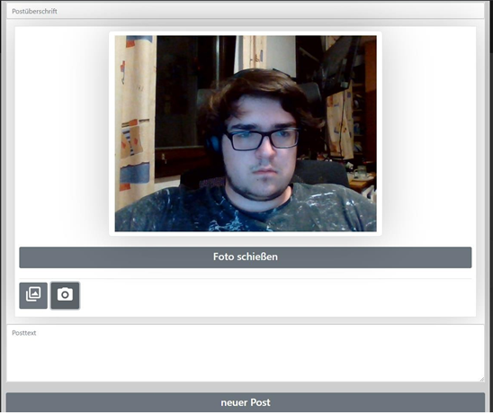
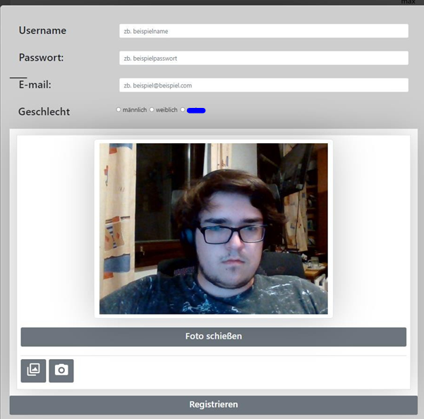

# Simplemedia

This Project is a simple Social Media Website.

- Motivation
- Description
- Learnings
- External Tools

## Motivation
My Motivation for this Project was to lern Java Spring boot and React. This Project was made in 2020, so my coding skills weren´t the best.

## Description 
On this Website you can create and view Posts.
To post a post, you have to be logged in.

A post is made of a picture , a title and a text.
Every Post can be liked.

To log in, you have to enter a username, a password, a e-mail, a gender and a photo. You can upload a picture or take one directly in the app.

After you´ve entered your email, you get a verification mail with a code.

## Learnings

- Java Spring boot
- React
- MySql
- Improved Java Skills
- Improved Java Script Skills

## External Tools

- Java Spring boot
- React
- MySql